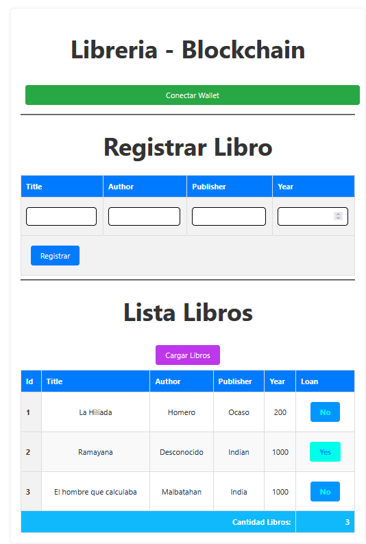
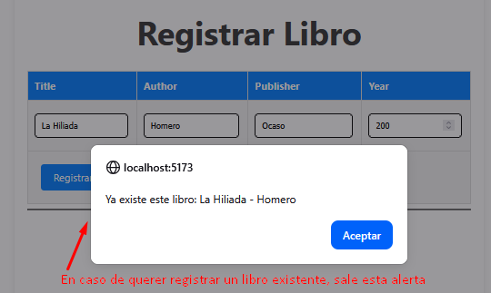
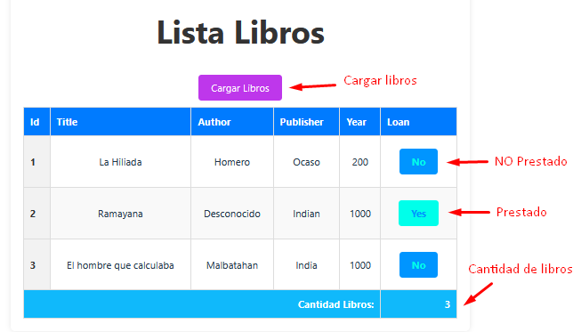

# Tarea de Contrato Library
**Juan Jose Valencia Oropeza**

## Sistema de control de libros.
El siguiente sistema permite:
- Registrar libros
- Prestar/Devolver libros
- Listar libros

El sistema consta de 2 partes.

## Contrato de Library
Se crea un contrato inteligente para registrar libros, y tambien pregistrar el prestamo de los mismos.

```solidity
// SPDX-License-Identifier: MIT
pragma solidity 0.8.30;

contract Library {

    // Libro
    struct Book {
        uint256 id;
        string title; // Titulo
        string author; // Autor
        string publisher; // publicacion
        uint year; // año de publicacacion
        bool loan; // Prestamo
    }

    mapping (uint256 => Book) public books;
    string[] public titlesAuthor;
    uint256[] public ids;
    uint256 index;


    // Guarda el libro, si es nuevo.
    function SaveBook(string memory _title, string memory _author, string memory _publisher, uint _year) public {
        bool flag = existBook(_title, _author);
        require(!flag, string.concat("Ya existe este libro: ", generateTitleAuthor(_title, _author)));
        Book memory b2 = Book({title: _title, author: _author, publisher: _publisher, year: _year, id: ++index, loan: false});
        string memory aux = generateTitleAuthor(_title, _author);
        titlesAuthor.push(aux);
        ids.push(index);
        books[b2.id]= b2;
    }

    function onLoan(uint256 _bookId) public {
        require(books[_bookId].id > 0, "No existe el libro!!!");
        Book memory b2 = books[_bookId];
        books[_bookId].loan = !b2.loan;
    }

    function listBooks() public view returns(Book[] memory) {
        Book[] memory list = new Book[](ids.length);
        for (uint i = 0; i < ids.length; i++) {
            list[i] = books[ids[i]];
        }
        return list;
    }

    // Devuelve true si existe el libro, caso contrario false.
    function existBook(string memory _title, string memory _author) internal view returns (bool) {
        bool flag = false;
        string memory aux = generateTitleAuthor(_title, _author);
        for (uint i= 0; i < index; i++){
            if (keccak256(abi.encodePacked(aux)) == keccak256(abi.encodePacked(titlesAuthor[i]))){
                flag = true;
                break;
            }
        }
        return flag;
    }

    function generateTitleAuthor(string memory _title, string memory _author) internal pure returns (string memory) {
        return string.concat(_title , " - ", _author);
    }

}
```

## FrontEnd
Se presenta un frontend que permite conectarse a la wallet y operar con el sistema.


### Conectar con wallet
Para conectar con la wallet, se debe presionar el boton **Conectar Wallet**, como se muestra en la imagen.


### Registrar Libro
Para registrar un libro nuevo, llenar el formulario. 


En caso de que el titulo y autor existan lanza una alerta y no permite registrar el libro.


### Listar Libros
Para listar los libros registrados, presionar el boton **Cargar Libros**, como se muestra en la imagen.


Se tiene un boton en cada libro para prestar/devolver el libro.
 
### Datos contrato

|||
|---|---|
|**Contrato**|0xd96c2589c4302cdd30fde4c4b25d6962c557b78e|
|**Verificación Contrato**|[Contrat](https://sepolia.etherscan.io/address/0xd96c2589c4302cdd30fde4c4b25d6962c557b78e)|
|**Git**|[Library-solidity](https://github.com/jjvos19/Library-solidity)|
|**Publicado**| [Library-web3](https://library-web3.vercel.app/)|